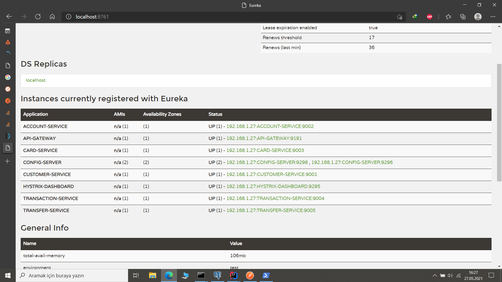
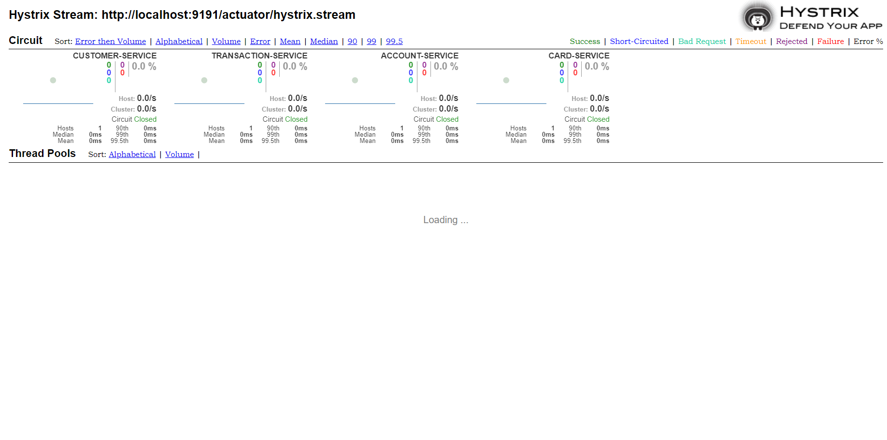
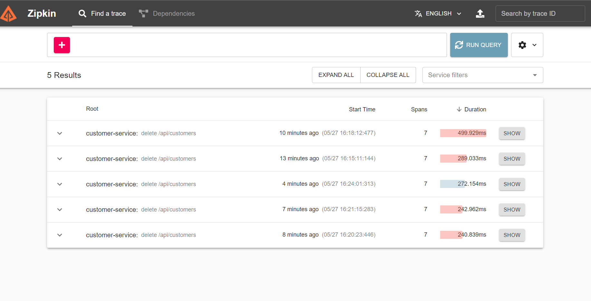
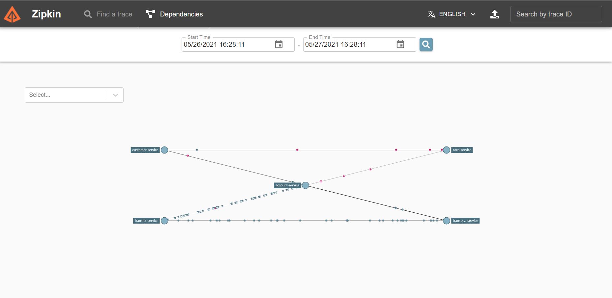

# Microservice-MyBank
Microservice-MyBank

Bu proje, Microservice Mimarisi ile basit bir banka uygulaması gerçekleştirilmesi amaçlanmıştır.

customer-service : Müşteri kayıtları tutulur ve müşterinin yapabileceği içerisinde basit işlemler yer alır, bir customer silindiğinde account, card, transaction servislerindeki tabloların içerisindeki müşteriye ait tüm verilerde silinir.

account-service: Müşteri EUR ya da TL hesabı açabilir. Bunun nedeni para dönüşüm API'larının abonelik sistemine geçmesinden ötürüdür. Çünkü benim kullandığım http://api.exchangeratesapi.io/v1/latest API'nın  base değerini kullanamıyorum, ücretsiz üyeliğim olduğu için EUR'nun diğer para birimlerinin karşılığını elde edebiliyorum.  Iban değeri otomatik oluşturmuyorum çünkü kullandığım çoğu tablo primary key'i UUID olarak tanımladım.

card-service: Sadece müşteri ve ilişkili hesap değeri alır. Id'sini otomatik kendi oluşturur. 

transfer-service: Hesap aracılığıyla ya da kart aracılığıyla başka hesaba para gönderilme işlemi yapılır. Burada aynı anda hem card, hem de account üzerinden bir para gönderimi yapılırsa account kayıdının eski versiyonunu elinde tutan işlem gerçekleşmez. (Optimistic Locking)

transaction-service: Yapılan transfer işlemlerini müşteriyi ve müşterinin yaptığı işleminin bilgilerini tutar.

eureka-svr: Tüm servislerin üzerinde çalıştığı server.

config-svr:  Github üzerinde tutulan eureka serverına bağlantı bilgilerini diğer servislerinde erişebilmesini sağlar.

gateway: customer-service, account-service, card-service, transaction-service ve transfer-service gibi servislerin kendi üzerinde eureka aracılığıyla yapılmasını sağlar(Ör: CUSTOMER-SERVICE/api/customers/get) gibi. Yani gateway'in server portu üzerinden   bu servislerin apilarına ulaşabiliyoruz. CircuitBraker işlemi buradadır.

hystrix-dashboard: gateway'in portu üzerinden dinlediği servisleri izler.

Ayrıca tracing işlemi için Zipkin Server kullanılmıştır.

`Eureka Server'ın tüm servisleri çalıştığı sırada görüntüsü`

`Gateway Service ile Hystrix aracılığıyla dinlediğimiz port üzerindeki servislerin durumları.`

`Zipkin üzerinde yapılan bazı işlemlerin görüntüsü `

`Zipkin Dependecies aracılığı servislerinin birbirler arasındaki bağlantıların görüntüsü`

